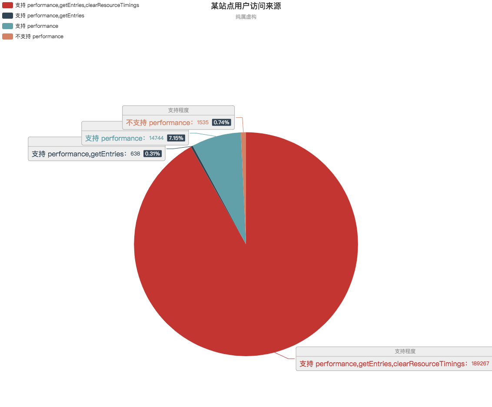

# TFSpeed 前端测速模块

## 背景

在前端开发中有一个跨不过的话题 ———— 性能优化。

与服务器端优化不同，服务器端机型与网络往往复杂度更加可控，数据采集上非常全面。

前端的性能优化则是要以用户的设备与网络环境为准，只以在自己设备上体验则会很大程度上会存在数据存在误差。

因此，唯有将用户每一次真实访问过程中的性能数据予以上报并进行统计，才得以衡量出来。

## 特性

- 渐进增强
    1. 不支持 performance
    2. 仅支持 performance (采集网络及浏览器数据)
    3. 仅支持 performance,genEntries (采集所有http请求数据)
    4. 支持 performance,genEntries,clearResourceTimings  (单页面适用接口 clearResourceTimings ，删除之前页面相关资源加载记录)
- 四类统计
    1. 页面生命周期测速 (pageLife)
    2. cgi测速 cgiSpeed
    3. 自定义代码执行测速 codeExec
    4. 资源测速(imgage,css,script)
- 事件系统 精简逻辑，只做数据采集。上报与采样逻辑通过事件系统暴露

## 使用

### 1. 安装

```shell
npm install tfspeed
```

### 2. 初始化

```html
<head>
    <script "text/javascript">
        // 在head处放置一个测速点，记录页面开始执行时间
        window.__pageStartTime = Date.now();
    </script>
</head>
```

```javascript
// JS代码
var TFSpeed = require('tfspeed');
var trackerItem = new TFSpeed({
    pageStartTime: window.__pageStartTime, // 传入head处的开始时间
    // naviStartTime: window.__pageStartTime,
    init: function () {
        console.log('初始化')
    }
});
exports.trackerItem = trackerItem;
```

### 3. 首屏渲染完成埋点

在页面完成首屏渲染的地方埋点，手动调用标记。

注：为了提高首屏渲染速度，建议将一些辅助逻辑异步加载，不要串行在主逻辑中。

```javascript
var trackerItem = require('./mod/tracker');
trackerItem.markPageLife('首页'); // 传入页面标题
```

### 4. ajax埋点监控

底层的`ajax`模块建议重写，加入如下逻辑以便进行`cgi`统计。

除了cgi以外，还会有部分类似加载 JSON 格式的数据文件，我们将其归为其他资源。

```javascript
var trackerItem = require('./mod/tracker');

// ajax请求开始处标记开始，输入键名标识
trackerItem.startMark(keyName);
// ajax请求结束，如果输入url参数，则标记为cgi。 未传入 url 则标记为 logType=3 自定义代码执行测速
trackerItem.endMark(keyName, {url: url});
```

### 5. 数据上报与采样

为了确保不影响主流程的渲染，首屏渲染完成后延时200ms进行数据上报。

对于一些用户数较大的业务，数据全量上报数据过于庞大，且对于测速来说，也无需全量上报，只需要等比例上报，既可以接近与全量上报统计数据的情况

```javascript
// 一些其他辅助逻辑建议在此处加载
trackerItem.on('markPageLife', function () {
    setTimeout(function () {
        // report 函数中只有单纯的 根据 trackerItem.isSendPageLife、trackerItem.isSendOtherType 来决定是否将数据进行上报，将会触发如下2个事件 beforeReport、afterSample
        trackerItem.report();
    }, 200);
});
// 调用report 第一句即触发 beforeReport 事件， 建议在此完成采样的逻辑判断
trackerItem.on('beforeReport', function () {
    // 采集率1/50,也可以根据页面情况自定义上报采用
    if(Math.random() * 50 > 1){
        trackerItem.isSendPageLife = false;
        trackerItem.isSendOtherType = false;
    }
    // 在最后上报前再采集资源，确保首屏渲染相关的资源加载数据都完成采集
    trackerItem.markResource();
});

// 上报方式需要自己进行实现，最佳实践是建议监听采样事件，采样后进行上报
// loglist 为采样后得到的数组, 如果采样结果为不上报，则数组为空
trackerItem.on('afterSample', function (loglist) {
    console.log(loglist);
    if(loglist && loglist.length > 0){
        postLogToServer(loglist); // 自行实现的上报函数
    }
});
```

### 6. 单页面跳转处理

针对目前流行的单页面框架，如何接入该组件，下面给一个参考。

```javascript
    // 1. 先删除之前的资源加载记录，避免下一个页面继续统计了上一个页面的资源
    trackerItem.clearResource();
    // 2. 以路由开始跳转时间为开始时间
    window.naviStartTime = Date.now();

    // 2与3之间对应的应该是加载对应页面的JS文件，类似于直跳中下载html文件

    // 3. 以对应页面模块加载完成事件为页面开始执行时间
    window.__pageStartTime = Date.now();

    // 4. 重新new一个测速实例，在新的实例上挂载事件监听与业务逻辑
    var trackerItem2 = new TFSpeed({
        pageStartTime: window.__pageStartTime, // 传入head处的开始时间
        naviStartTime: window.naviStartTime,
        init: function () {
            console.log('初始化')
        }
});
```

## 技术调研

由于设备机型千差万别，接口支持程度无法统一；因此，建议先对用户机器对于测速接口的支持程度进行统计。

### 接口简介

先简单介绍以下接口以及使用的场景，更加详细的可以参考更多介绍`performance`的文章。

1. `performance`为浏览器提供的测速接口，可以获取到navigationStart,DNS耗时,TCP建立连接耗时,DOM渲染耗时 等相关耗时的数据
2. `performance.getEntries`则可以获取所有资源加载的数据，通过这个接口我们可以得到更详细的 ajax请求耗时，css，script，img等资源请求的耗时
3. `performance.clearResourceTimings` 则可以清除当前记录的资源加载数据 注：单页面跳转到新页面的时候建议通过此接口清除之前页面的资源加载数据

### 接口支持统计

以我们业务用户为例，用户分布在微信与手Q。
通过采集用户上报的数据得到如下表格

**按平台**

|  平台 | 支持性 | 占比 |
| ------------ | ------------|------------|
|微信 | 不支持 performance | 0.75%  |
|微信 | 支持 performance | 6.79% |
|微信 | 支持 performance,getEntries| 0.3% |
|微信 | 支持 performance,getEntries,clearResourceTimings | 92.16% |
|手Q | 不支持 performance | 0.43%  |
|手Q | 支持 performance | 22.57% |
|手Q | 支持 performance,getEntries  | 1.81% |
|手Q | 支持 performance,getEntries,clearResourceTimings| 75.19% |



**以操作系统维度看**

|  系统 | 支持性 | 占比 |
| ------------ | ------------|------------|
|Android | 不支持 performance | 0%  |
|Android | 支持 performance | 0.01% |
|Android | 支持 performance,getEntries| 0.37% |
|Android | 支持 performance,getEntries,clearResourceTimings | 99.62% |
|IOS | 不支持 performance | 2.8%  |
|IOS | 支持 performance | 26.92% |
|IOS | 支持 performance,getEntries  | 0.15% |
|IOS | 支持 performance,getEntries,clearResourceTimings| 70.13% |

在操作系统维度上，我们再对系统版本进行分析可得。

IOS下不支持performance的系统版本分步在IOS8.3以下

### 如何看待接口支持性差异

测速数据的收集与上报，是为了得到最全的用户整体性能数据。
当一类用户占比过高时，直接将其剔除，往往会使得数据失准，因此需要先得到用户支持占比的情况。

建议引入本组件后，先对用户占比进行统计。

在我们的用户中 不支持performance 接口的用户占比极低。因此，我们会将其予以剔除

因为我们用户并未采用单页面，而是直跳。

因此 `clearResourceTimings` 接口的对我们的业务也是无效的。

## 格式设计

### 起点时间坐标

`TFSpeed.naviStartTime`: 以 `performance.timing` 接口的 `navigationStart` 为统一的起点时间坐标，如果不支持 `performance` 则以 `window.__pageStartTime` 为作为统一的时间起点。

`TFSpeed.pageStartTime`: 为head中第一句JS开始执行的时间

原因：所有的测速都标记上与 `TFSpeed.naviStartTime` 的相对时间，如此可以将所有测速数据在一张图上进行绘制。

### startTime 开始时间

对于 `pageLife`来说，`startTime`即为 `TFSpeed.pageStartTime` 与 `TFSpeed.naviStartTime` 的差值，代表页面开始解析执行的开始时间。

对于 ajax请求与其他资源加载 来说，`startTime`即为其相当于 `TFSpeed.naviStartTime` 的时间

### duration 耗时

`duration` 即为耗时，也是测速最核心的指标。

1. 对于`pageLife`来说即为从 `TFSpeed.pageStartTime` 到代码里调用 `markPageLife('首页')` 的耗时
2. 对于 ajax 来说，如果支持 `performance.getEntries` 则以接口数据为准，不支持则以 `startMark-endMark` 的时间差为准
3. 自定义标记耗时 则是单纯通过调用 `startMark-endMark` 来标记
4. 如果用户设备支持 `performance.getEntries` 则加以采集。

通过以上格式，我们可以在管理端查看到用户整个页面打开过程中，距离webview打开多久后发起请求，请求耗时多久。例如下图。


## 相关参数说明

### 文件大小

通过`performance.getEntries`得到的数据中包含`encodedBodySize`与`decodedBodySize`，代表压缩前后的大小，单位为`Byte`。

一般会在`nginx(or apache)` 开启 gzip 压缩，浏览器再进行解压缩。在开发者工具面板也可以看到这个数据。

通过上报该数据，可得到页面、cgi以及其他资源的大小观察。


### 渲染完成时CGI与资源请求数

`TFSpeed.pageLife` 中包含了三个计数器

通过统计一个页面完成渲染时，请求的cgi数量以及资源加载数量，来衡量该页面是否可以通过减少相应请求的方式进行优化。

```javascript
    TFSpeed.pageLife = {
        cgi: 0, // cgi请求数量
        resource: 0, // 其他资源加载数量 包括 css img script
        codeExec: 0 // 自定义测速数，通过 startMark endMark 来计算执行耗时(除去cgi类)
    }
```

### 其他相关数据

简单介绍一下几个核心指标，更加详细的可以阅读 参考资料1。

1. `domainLookupStart-domainLookupEnd` 为 `dns` 耗时
2. `connectStart-connectEnd` 为tcp建立耗时
3. `requestStart-responseStart-responseEnd` 为请求发出->第一个字节开始返回->返回完全接收
4. `domComplete` 顾名思义，所有处理完成，并且网页上的所有资源（图像等）都已下载完毕，也就是说，加载转环已停止旋转

**关于数据缺失** 从采集的数据来看，数据并非都是如此规范，例如许多数据只有`responseEnd`值为真实有效，有些与 `TFSpeed.naviStartTime` 相减为负数，针对这种情况。我们进行如实上报，在数据格式化过程中进行处理，这类数据入库时我们将其置为`null`，这样利于 `mysql avg` 函数求均值时，`null`值会不被计入，不会对均值造成影响。

## 参考资料

1. [PerformanceTiming](https://developer.mozilla.org/zh-CN/docs/Web/API/PerformanceTiming)
2. [timing.js](https://github.com/addyosmani/timing.js/blob/master/timing.js)
3. [初探 performance – 监控网页与程序性能](http://www.alloyteam.com/2015/09/explore-performance/)
4. [评估关键渲染路径](https://developers.google.com/web/fundamentals/performance/critical-rendering-path/measure-crp?hl=zh-cn)
